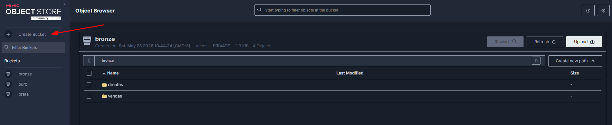

# Criando um DataLake com Docker (Trino, Hive e Minio)
## 1. Faça o build do seu Dockerfile
```bash
docker build -t my-hive-metastore .
```

## 2. Suba seu docker-compose
```bash
docker compose up -d
```

## 3. Veja se tudo está fuincionando
```bash
docker ps
```
```bash
CONTAINER ID   IMAGE                      COMMAND                  CREATED          STATUS                    PORTS                                                             NAMES
b042835c976e   trinodb/trino:latest       "/usr/lib/trino/bin/…"   48 minutes ago   Up 42 minutes (healthy)   0.0.0.0:8080->8080/tcp, [::]:8080->8080/tcp                       datalake-trino-coordinator-1
8434cfb7b435   my-hive-metastore:latest   "/entrypoint.sh"         54 minutes ago   Up 54 minutes             0.0.0.0:9083->9083/tcp, [::]:9083->9083/tcp                       datalake-hive-metastore-1
72c4f505d311   postgres:11                "docker-entrypoint.s…"   54 minutes ago   Up 54 minutes             0.0.0.0:5431->5432/tcp, [::]:5431->5432/tcp                       datalake-postgres-1
84ece90e43e9   minio/minio:latest         "/usr/bin/docker-ent…"   54 minutes ago   Up 54 minutes             0.0.0.0:9000-9001->9000-9001/tcp, [::]:9000-9001->9000-9001/tcp   minio
```
Todos estão rodando corretamente.

## 4. Crie seus respectivos buckets no Minio
Acesse o localhost: `http://localhost:9001/`

Aqui é onde os dados vão ficar.

## 5. Acesse o Trino
Acesse o terminal do Trino:
```bash
docker exec -it datalake-trino-coordinator-1 trino
```
Olhe os **catalogs**:
```sql
SHOW CATALOGS;
```
É para aparecer esses 4:
```
trino> show catalogs;
 Catalog 
---------
 minio   
 system  
 tpcds   
 tpch    
(4 rows)
```
## 6. Crie o Schema
Dentro do trino crie seu Schema que aponta para seu bucket no `minio`:
```sql
CREATE SCHEMA minio.bronze
WITH (location = 's3a://bronze/');
```

## 7. Crie sua tabela
```sql
CREATE TABLE minio.bronze.vendas (
    cliente_id     BIGINT,
    produto        VARCHAR,
    quantidade     INTEGER,
    valor_unitario DOUBLE,
    valor_total    DOUBLE,
    data_venda     TIMESTAMP
)
WITH (
    format            = 'PARQUET',
    external_location = 's3a://bronze/vendas/'
);
```
Pronto tabela criada agora você pode adicionar registros a ela:
```sql
INSERT INTO minio.bronze.vendas VALUES
    (BIGINT '1',  'Notebook',        1, 3500.00, 3500.00, TIMESTAMP '2024-01-20 10:00:00'),
    (BIGINT '1',  'Mouse',           2,   89.90,  179.80, TIMESTAMP '2024-01-20 10:00:00'),
    (BIGINT '2',  'Teclado',         1,  149.90,  149.90, TIMESTAMP '2024-02-21 14:30:00'),
    (BIGINT '2',  'Monitor',         1, 1200.00, 1200.00, TIMESTAMP '2024-02-22 09:00:00'),
    (BIGINT '1',  'Headset',         1,  299.90,  299.90, TIMESTAMP '2024-03-10 16:00:00'),
    (BIGINT '2',  'Webcam',          1,  189.90,  189.90, TIMESTAMP '2024-03-15 11:00:00'),
    (BIGINT '1',  'SSD 1TB',         1,  450.00,  450.00, TIMESTAMP '2024-03-18 14:00:00'),
    (BIGINT '2',  'Cadeira Gamer',   1,  899.00,  899.00, TIMESTAMP '2024-04-02 09:30:00'),
    (BIGINT '1',  'Hub USB',         2,   79.90,  159.80, TIMESTAMP '2024-04-10 16:45:00'),
    (BIGINT '2',  'Suporte Monitor', 1,  120.00,  120.00, TIMESTAMP '2024-04-15 13:00:00');
```
E consequentemente fazer consultas:
```sql
select * from minio.bronze.vendas;

---
 id | cliente_id |     produto     | quantidade | valor_unitario | valor_total |       data_venda        
----+------------+-----------------+------------+----------------+-------------+-------------------------
  1 |          1 | Notebook        |          1 |         3500.0 |      3500.0 | 2024-01-20 10:00:00.000 
  2 |          1 | Mouse           |          2 |           89.9 |       179.8 | 2024-01-20 10:00:00.000 
  3 |          2 | Teclado         |          1 |          149.9 |       149.9 | 2024-02-21 14:30:00.000 
  4 |          2 | Monitor         |          1 |         1200.0 |      1200.0 | 2024-02-22 09:00:00.000 
  5 |          1 | Headset         |          1 |          299.9 |       299.9 | 2024-03-10 16:00:00.000 
  6 |          2 | Webcam          |          1 |          189.9 |       189.9 | 2024-03-15 11:00:00.000 
  7 |          1 | SSD 1TB         |          1 |          450.0 |       450.0 | 2024-03-18 14:00:00.000 
  8 |          2 | Cadeira Gamer   |          1 |          899.0 |       899.0 | 2024-04-02 09:30:00.000 
  9 |          1 | Hub USB         |          2 |           79.9 |       159.8 | 2024-04-10 16:45:00.000 
 10 |          2 | Suporte Monitor |          1 |          120.0 |       120.0 | 2024-04-15 13:00:00.000 
(10 rows)

Query 20260523_233233_00016_spxcg, FINISHED, 1 node
Splits: 1 total, 1 done (100.00%)
0.28 [10 rows, 1.57KiB] [35 rows/s, 5.6KiB/s]
```

## 8. Desligando o Docker
```bash
docker compose down
```

## 9. Religando o Docker
```bash
docker compose up
```
Os dados vão `persistir` pois criamos volumes para salvar os dados