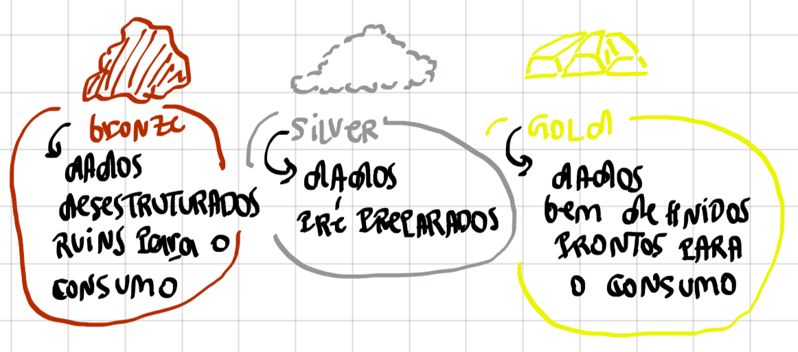

# Bronze | Silver | Gold
São formas de `rotular` nossos dados com base em '*quão bem preparados eles estão*'. Se um dado estiver muito desestruturado ainda não muito confiavel para o consumo mas nos o possuimos rotulamos ele como **BRONZE** se fazemos algumas transformações nele para deixar mais viavel para o consumo chamamos ele de **SILVER** se adequamos ele a uma regra ou conceito de negócio pronto para o consumo nessa visão chamamos de **GOLD**. Os temos **BRONZE, SILVER** & **GOLD** também podem ser chamados de **SOR () Source of Resource**, **SOT (Source Of Truth)** & **SPEC (Specialist)** respectivamente.
